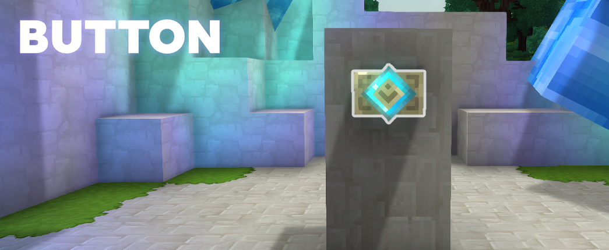
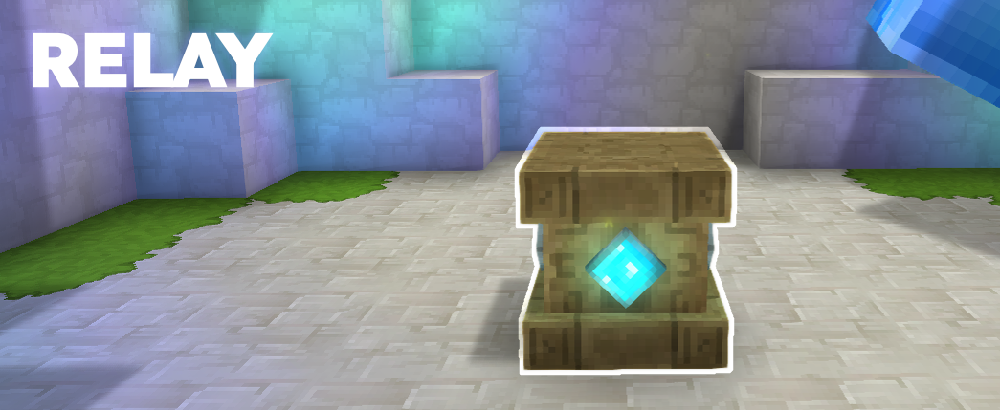
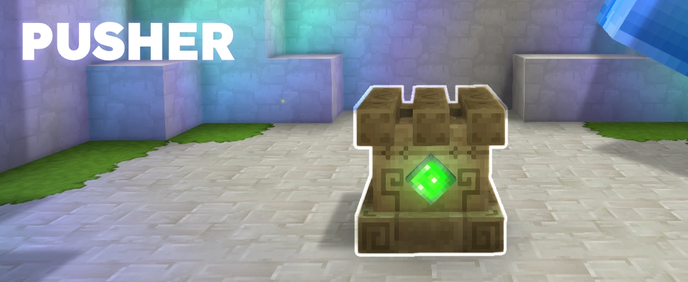
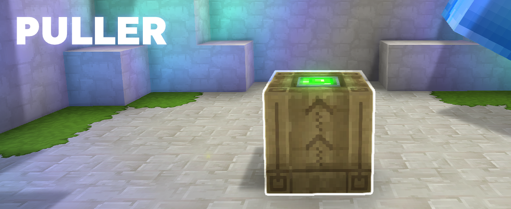

# Arcane Relay
This is a Hytale mod that attempts to add our own take at a custom logic system.

The repository is open source so feel free to use our code or assets in any other project. We also have the `./art` directory which includes all of our raw art files. Have fun!

## Additions


This are our backbone of the mod, without them you can't do much, with them you can create and link arcane blocks to send signals between them.

---



The most basic logic item in our mod! It allows the player to interact with it to send/relay a signal. Use the Arcane Staff to connect it to other components and trigger them from a distance. 


---

 

Similar to the button this is used to send/relay a signal to other arcane blocks. But it's also a full block, so it can be moved!

---

 

Like a relay but with two states! This one is hard to explain without being technical, so here is the item description: Used to block or relay signal depending on state. When a signal is received it always toggles it's state. If active it will relay the signal, if inactive it will stop the relay. Interact with the block to toggle the starting state.

---



This is our own take on a Piston. It pushes the block above it in the direction specified by it's orientation, will push more blocks if there are any on the way.

---



This block only pulls! But it has an extended range, use it to pull back the first block it encounters within 15 blocks!

## Plugin Development

### Activations

When an arcane signal reaches a block, the mod looks up which **activation** to run. Activations live under `Server/Item/Activations/` as JSON; the **filename** (without `.json`) is the activation ID (e.g. `Arcane_Relay`, `Toggle_Pusher`).

**Using existing types:** Add a JSON file and set `Type` to one of the built-in types. Example for a simple on/off relay:

```json
{
  "Type": "ToggleState",
  "OnState": "default",
  "OffState": "Off",
  "SendSignalWhen": "Off"
}
```

**Chaining activations:** Use type `Chain` and list activation IDs to run in order:

```json
{
  "Type": "Chain",
  "Activations": ["Move_Block", "Toggle_Pusher"]
}
```

**Creating a new activation type (Java):** Implement a class that extends `Activation`, register its codec in your plugin's `setup()`, then add JSON assets that use your `Type`:

```java
// In setup():
ArcaneRelayPlugin.get().getCodecRegistry(Activation.CODEC)
    .register("MyCustom", MyCustomActivation.class, MyCustomActivation.CODEC);

// Your class:
public class MyCustomActivation extends Activation {
    public static final BuilderCodec<MyCustomActivation> CODEC = BuilderCodec.builder(
            MyCustomActivation.class, MyCustomActivation::new, Activation.ABSTRACT_CODEC)
        // .appendInherited(...) for your fields, then .add() and .build()
        .build();

    @Override
    public void execute(@Nonnull ActivationContext ctx) {
        // ctx.world(), ctx.chunk(), ctx.blockX/Y/Z(), ctx.blockType(), ctx.sources()
        // Use ActivationExecutor.playEffects(), playBlockInteractionSound(), sendSignals(ctx) as needed.
    }
}
```

#### Existing activation types

| Type | Description |
|------|-------------|
| **ToggleState** | Toggles block between two states (e.g. On/Off). Options: `OnState`, `OffState`, `SendSignalWhen`, `OnEffects`, `OffEffects`. |
| **SendSignal** | Forwards the signal to connected outputs. No state change. |
| **ArcaneDischarge** | Cycles charge states; sends signal when going from fully charged to off. Options: `Changes` (state map), `MaxChargeState`, `MaxChargeStateSuffix`. |
| **MoveBlock** | Pushes blocks in the facing direction (e.g. piston). Options: `Range`, `IsWall`. |
| **ToggleDoor** | Toggles a door block in front. Options: `Horizontal`, `OpenIn`, `IsWall`. |
| **Chain** | Runs several activations in sequence. Option: `Activations` (array of activation IDs). |

#### Bindings

Bindings decide **which activation runs for which block**. They live under `Server/Item/ActivationBindings/` as JSON.

- **Bindings** – Object mapping block type key → **reference or inline activation** (like interactions: either an id or Type + params).
  - **Reference:** `{ "Id": "Arcane_Relay" }` (reference to Item/Activations asset).
  - **Inline (Type + params):** `{ "Activation": { "Type": "SendSignal" } }` or `{ "Activation": { "Type": "ToggleDoor", "OpenIn": false, "Horizontal": true } }` (same shape as `Item/Activations/*.json`).
- **Default** (optional) – Fallback activation ID when a block type is not in Bindings.

You can use **one file** with all keys, or **multiple files**; multiple files are merged and **later files (by asset id / filename) override earlier** for the same key.

Example – references only:

```json
{
  "Bindings": {
    "Pseudo_Arcane_Relay": { "Id": "Arcane_Relay" },
    "Torch": { "Id": "Toggle_Torch" }
  },
  "Default": "use_block"
}
```

Example – **inline activation** (Type + params, no separate asset):

```json
{
  "Bindings": {
    "Pseudo_Arcane_Relay": { "Id": "Arcane_Relay" },
    "Some_Custom_Block": {
      "Activation": { "Type": "SendSignal" }
    },
    "Another_Block": {
      "Activation": { "Type": "ToggleDoor", "OpenIn": false, "Horizontal": true }
    }
  },
  "Default": "use_block"
}
```


## Building the Project
You will need to have Maven installed on your machine.

### Prerequisites
- Java 25 (or compatible)
- Maven 3.x
- Hytale game installed

### Dependencies
To build the project make sure to go to `./pom.xml` and under dependencies ensure that the com.hypixel.hytale `<version>{hytale_version}</version>` has the latest release version of the game.

Then you can run the following:
```
mvn -U -X dependency:resolve
```

### Building and Installing Manually
Run the following command to generate the `arcanerelay-X.Y.Z.jar` file:
```
mvn clean install
```
You can then copy it manually into your mod folder.

### Deploy
Alternativley, you can do the following to build and move the JAR automatically to your mod folder:
1. Copy `.env.example` to `.env` and update the `HYTALE_MODS` path to your Hytale mods directory.
   - Mac: `/Users/username/Library/Application Support/Hytale/UserData/Mods`
   - Windows: `C:\Users\username\AppData\Roaming\Hytale\UserData\Mods`
2. Run the deploy script:
   - Mac/Linux: `./deploy.sh`
   - Windows: `deploy.bat`

### VS Code Task
You can setup the following vscode task to deploy it:
```json
{
    "version": "2.0.0",
    "tasks": [
        {
            "label": "Deploy ArcaneRelay",
            "type": "shell",
            "command": "if [ -f deploy.sh ]; then ./deploy.sh; else deploy.bat; fi",
            "group": {
                "kind": "build",
                "isDefault": true
            },
            "presentation": {
                "echo": true,
                "reveal": "always",
                "focus": false,
                "panel": "shared"
            },
            "options": {
                "cwd": "${workspaceFolder}"
            }
        }
    ]
}
``` 